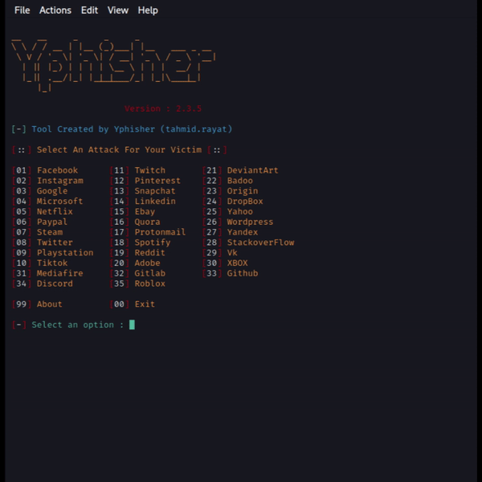

<!-- Yphisher -->

<p align="center">
  
</p>

<p align="center">
  
  
</p>

<p align="center">
  <a href="https://github.com/Yashdon999">
  
</a>
  
  
  
</p>

<p align="center"><b>A beginners friendly, Automated phishing tool with 30+ templates.</b></p>

##

<h3><p align="center">Disclaimer</p></h3>

***Ultimate phishing tool . Includes popular websites like facebook, twitter, instagram, github, reddit, gmail and many others.***

This project is now a part of [Yphisher](https://github.com/Yashdon999/yphisher). Further bug fixes and feature addition will be available in that


<i>Any actions and or activities related to <b>Yphisher</b> is solely your responsibility. The misuse of this toolkit can result in <b>criminal charges</b> brought against the persons in question. <b>The contributors will not be held responsible</b> in the event any criminal charges be brought against any individuals misusing this toolkit to break the law.

<b>This toolkit contains materials that can be potentially damaging or dangerous for social media</b>. Refer to the laws in your province/country before accessing, using,or in any other way utilizing this in a wrong way.

<b>This Tool is made for educational purposes only</b>. Do not attempt to violate the law with anything contained here. <b>If this is your intention, then Get the hell out of here</b>!

It only demonstrates "how phishing works". <b>You shall not misuse the information to gain unauthorized access to someones social media</b>. However you may try out this at your own risk.</i>

##

### Features

- Multi platform (Supports most linux)
- Beginners friendly
- Latest and updated login pages.
- Multiple tunneling options
  - Localhost
  - Cloudflared
  - LocalXpose
- Docker support
- Mask URL support 

##

### Support

OS         | Support Level
-----------|--------------
Linux      | Excellent
Android    | Excellent
iPhone     | Alpha (Recommended docker)
MacOS      | Alpha (Recommended docker)
Windows    | Unsupported (Use docker/virtual-box/vmware)

##

### Installation

- Just, Clone this repository -
  ```
  git clone --depth=1 https://github.com/Yashdon999/yphisher.git
  ```

- Now go to cloned directory and run `yphisher.sh` -
  ```
  $ cd yphisher
  $ bash yphisher.sh
  ```

- On first launch, It'll install the dependencies and that's it. ***Yphisher*** is installed.

##

### Installation (Termux)
You can easily install yphisher in Termux by using tur-repo
```
$ pkg install tur-repo
$ pkg install yphisher
$ yphisher
```
### A Note : 
***Termux discourages hacking*** .. So never discuss anything related to *yphisher* in any of the termux discussion groups. For more check : [wiki](https://wiki.termux.com/wiki/Hacking)


### Installation via ".deb" file

- Download `.deb` files from the [**Latest Release**](https://github.com/htr-tech/yphisher/releases/latest)
- If you are using ***termux*** then download the `*_termux.deb`

- Install the `.deb` file by executing
  ```
  apt install <your path to deb file>
  ```
  Or
  ```
  $ dpkg -i <your path to deb file>
  $ apt install -f
  ```

##

### Run on Docker

- Docker Image Mirror:
  - **DockerHub** : 
    ```
    docker pull htrtech/yphisher
    ```
  - **GHCR** : 
    ```
    docker pull ghcr.io/htr-tech/yphisher:latest
    ```

- By using the wrapper script [**run-docker.sh**](https://raw.githubusercontent.com/htr-tech/yphisher/master/run-docker.sh)

  ```
  $ curl -LO https://raw.githubusercontent.com/htr-tech/yphisher/master/run-docker.sh
  $ bash run-docker.sh
  ```
- Temporary Container

  ```
  docker run --rm -ti htrtech/yphisher
  ```
  - Remember to mount the `auth` directory.

##

<details>
  <summary><h3>Dependencies</h3></summary>

<b>Yphisher</b> requires following programs to run properly - 
- `git`
- `curl`
- `php`

> All the dependencies will be installed automatically when you run **Yphisher** for the first time.
</details>

<details>
  <summary><h3>Tested on</h3></summary>

- **Ubuntu**
- **Debian**
- **Arch**
- **Manjaro**
- **Fedora**
- **Termux**
</details>

##

<h3 align="center"><i>:: Workflow ::</i></h3>
<p align="center">

</p>

##

## [!] Disclaimer
***This tool is developed for educational purposes. Here it demonstrates how phishing works. If anybody wants to gain unauthorized access to someones social media, he/she may try out this at his/her own risk. You have your own responsibilities and you are liable to any damage or violation of laws by this tool. The author is not responsible for any misuse of PyPhisher!***

### This repository is open source to help others. So if you wish to copy, consider giving credit!

## Credits:
Some base codes and templates are from [htr-tech](https://github.com/htr-tech/zphisher), Some Designes from [MaxPhisher](https://github.com/KasRoudra/MaxPhisher)
, and the Sites Updated by [Yash](https://github.com/Yashdon999/yphisher)

### Find Me on:


- [](https://github.com/Yashdon999)
- [](https://t.me/error_short)

